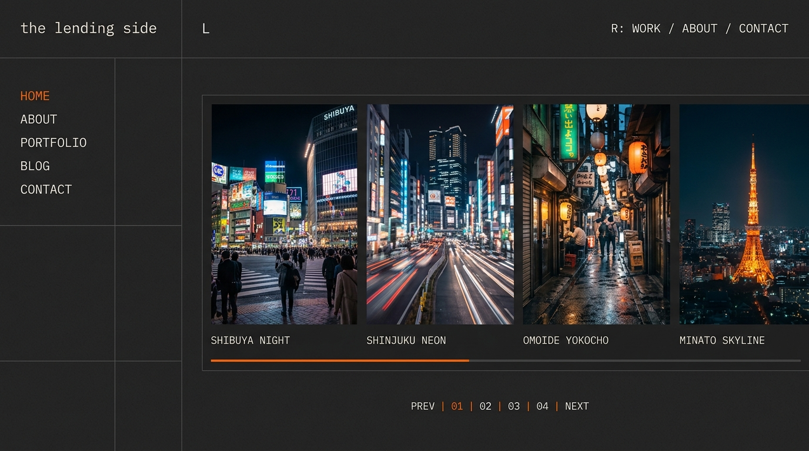
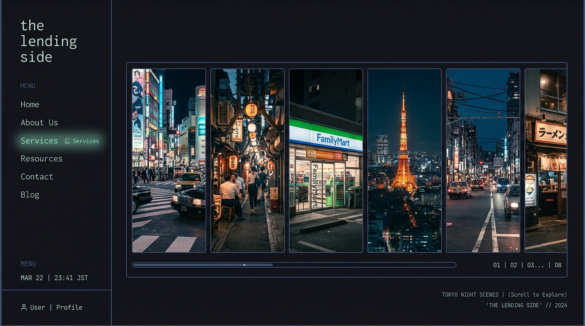
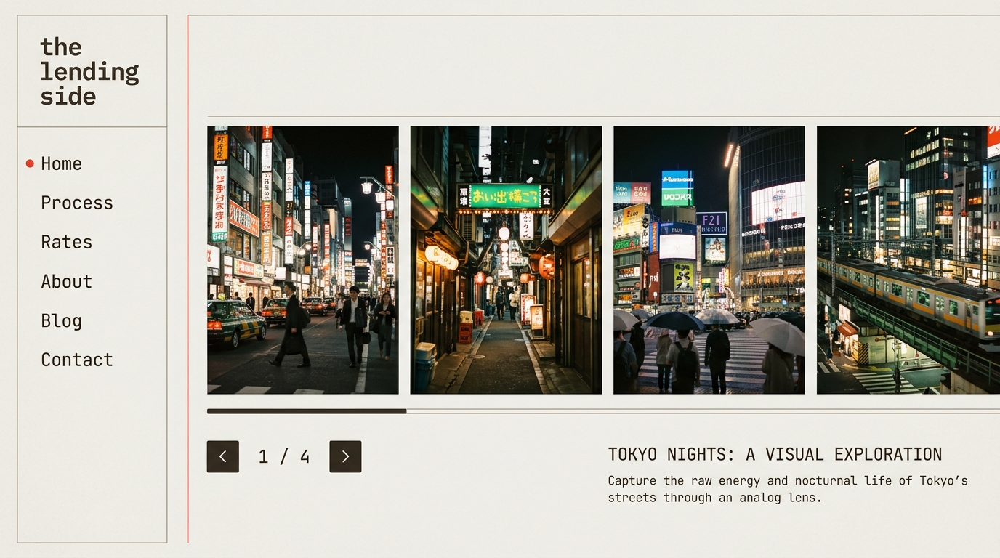

# The Lending Side — Digital Photobook

A lightweight, high-performance, self-hosted static web front-end and CMS for [thelendingside.com](https://thelendingside.com). This project decouples your blog posts, prose, and analog images from WordPress.com, storing them locally.

## Design Aesthetic

- **Tactile Analog Feel**: Features a custom-animated SVG film grain overlay.
- **Terminal Monospace Style**: Complete monospace integration (`IBM Plex Mono`), sodium streetlight amber (`#ff9000`) accents, sharp layouts, and zero rounded corners to match urban/street high-contrast photography.
- **Dynamic Layouts**: Switch dynamically between:
  - `Film_strip View`: Horizontal sliding posts simulating a physical photobook.
  - `Journal View`: Editorial vertical text flow for narrative prose.
  - `Index View`: Minimalist grid of photography covers.
- **EXIF HUD**: Pulls technical camera parameters (aperture, shutter speed, focal length, ISO, camera body) and displays them as terminal specs on image hover, lightbox expands, or inline journal labels.
- **Bespoke Prints Portal**: Select a photo to initiate a print request form, which automatically formats a draft email matching size and image information.

---

## Local Development & CMS

### Step 1: Start the API Server
Since you have Python 3.12 active, you can launch our custom, single-file API server from this directory. It serves the static website and provides the backend endpoints for saving posts and uploading images:

```bash
python server.py
```
This runs a local HTTP server at `http://localhost:8000`.

### Step 2: Access the Admin CMS
Visit `http://localhost:8000/#admin` to open the terminal-styled **CMS Posts Database**. From here you can:
- View all posts.
- Click **[ Compose New Post ]** or **Edit** existing posts.
- Drag & drop photography files directly into the upload area to save them in your local `images/` directory.
- Manually key in camera EXIF tags for uploaded film scans (camera, focal length, aperture, shutter speed, and ISO).
- Copy formatted HTML tags of uploaded images to paste inside the content prose body.
- Wreck or delete old entries.
- Click **Save** to write modifications instantly to `data/posts.json`.

---

## Alternative Method: Docker Compose

If you prefer to run Nginx mapping the directory, use:

```bash
docker compose up -d
```
Then visit `http://localhost:8080` in your browser. (Note: The Docker Compose serves static files but does not execute the Python API CMS. To use the CMS uploader/saving actions, run `python server.py` directly).

---

## Importing Historical Posts

If you ever need to scrape or re-sync posts from your WordPress.com blog to your local database, run the scraper script:

```bash
python scripts/fetch_posts.py
```
This will query the WordPress API, download all high-resolution images to the local `images/` directory, extract any embedded EXIF tags, and compile them into `data/posts.json`.

---

## Layout-Preserving Style Proposals

These proposals preserve your exact website structure (the left sidebar navigation with monospace branding and the horizontal scrolling image slides on the right) while exploring three different color, border, and accent styles.

### Option A: Shibuya Concrete (Dark Street Theme)

Inspired by the dark asphalt roads and warning sign grids of Tokyo streets.
- **Background**: `#1c1d22` (Dark concrete grey)
- **Text**: `#e2e4e9` (Soft off-white)
- **Active State Highlights & Stoplight**: `#f97316` (Saturated signal orange)
- **Panel Borders**: `#2d2f39` (Solid charcoal borders)



### Option B: Rain-Slicked Midnight Blue (Moody Night Theme)

Inspired by rain-slicked pavement reflecting blue hour skies and jade signs.
- **Background**: `#0b0d17` (Deep midnight indigo-blue)
- **Text**: `#cbd5e1` (Soft slate grey)
- **Active State Highlights & Stoplight**: `#34d399` (Glowing neon jade green)
- **Panel Borders**: `#1d2433` (Thin slate borders)



### Option C: Polaroid Sepia (Warm Film Theme - Light Mode Focus)

Inspired by vintage separation prints, sepia developer chemicals, and red Polaroid labels.
- **Background**: `#fcfbfa` (Warm Polaroid paper texture)
- **Text**: `#3c3935` (Dark warm-sepia charcoal)
- **Active State Highlights**: `#dc2626` (Analog film strip red)
- **Panel Borders**: `#e5e0d8` (Very soft warm grey borders)


